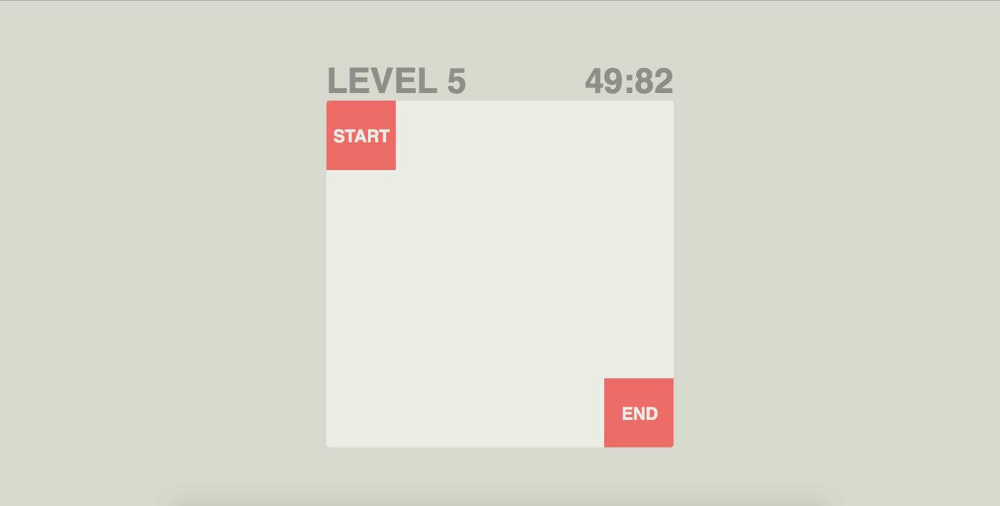

# Audio Maze
  * Escape the maze by moving your mouse cursor around and hearing the increaisng notes!

## Introduction
  * Audio Maze is an audio web game designed and developed for the K-12 students in North Carolina. The goal of this game is to provide a fun gaming experience to them, including those with visual impairments. The game is going be used for Maze Day, an annual event hosted by the Computer Science department of UNC-Chapl Hill.

## Screenshots

</img>
</img>

## Technologies used
  * Language: HTML, CSS, and JavaScript
  * JavaScript Library: jQuery, Tone.js

## Links
  * Game published at - https://chansun.github.io/audio_maze/
  * More information about Maze Day - https://cs.unc.edu/outreach/maze-day/