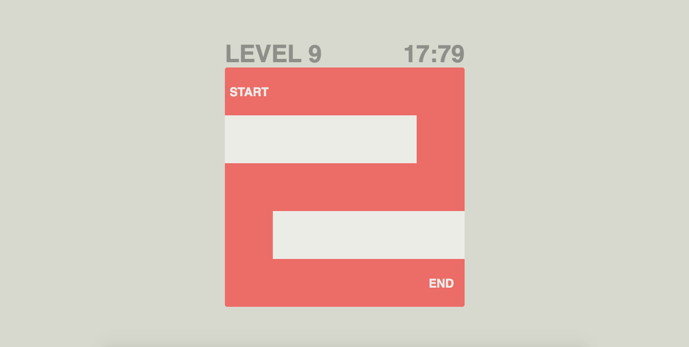

# Audio Maze
  * Escape the maze by moving your mouse around and hearing the increaisng notes!

## Introduction
  * Audio Maze is an audio web game designed and developed for the K-12 students with visual impairments in North Carolina. In this game, the user has to escape the maze by moving the mouse around and hearing the corresponding sound; the maze has 15 levels in total. The game is used for Maze Day, an annual event hosted by the Computer Science department of UNC-Chapl Hill.

## Screenshots

</img>
</img>
</img>

## Technologies
  * Architecture: Model-View-Controller (MVC)
  * Language: HTML, CSS, and JavaScript
  * JavaScript Library: jQuery and Tone.js

## Technical difficulty and how I overcame it
  * to be filled ... 

## Links
  * Game published at - https://chansun.github.io/audio-maze/ (Chrome is recommended)
  * More information about Maze Day - https://cs.unc.edu/outreach/maze-day/